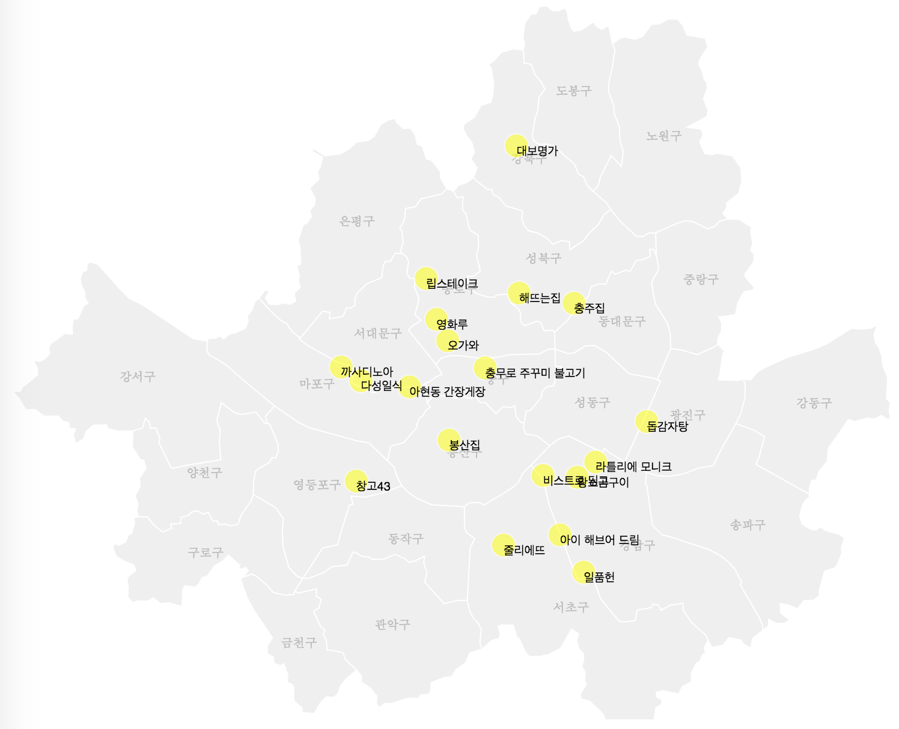

Seoul Maps
==========

This repo hosts Seoul administrative division geodata in open formats that can be used to build static and interactive maps (e.g. with [D3](http://d3js.org)).

To see maps for South Korea, go to https://github.com/southkorea/southkorea-maps

## Description
### Formats
The following formats are available:
[`Shapefile`](http://en.wikipedia.org/wiki/Shapefile),
[`GeoJSON`](http://geojson.org),
and [`TopoJSON`](http://github.com/mbostock/topojson).

### Sources
Data is acquired from the following sources:

- [KOSTAT](http://kostat.go.kr): [Administrative division geodata for Census (센서스용 행정구역경계), 2013](http://sgis.kostat.go.kr/statbd/statbd_03.vw)
- [JUSO](http://www.juso.go.kr/): [서울시 행정구역 읍면동 위치정보, 2015](http://data.seoul.go.kr/openinf/mapview.jsp?infId=OA-13223)
- [JUSO](http://www.juso.go.kr/): [서울시 행정구역 시군구 정보, 2015](http://data.seoul.go.kr/openinf/mapview.jsp?infId=OA-11677)

### Levels
Seoul administrative divisions are consisted of two levels:

- [Municipalities (시군구)](http://en.wikipedia.org/wiki/Administrative_divisions_of_South_Korea#Municipal_level_divisions): Si (시, city), Gun (군, county), Gu (구, district)
- [Submunicipalities (읍면동)](http://en.wikipedia.org/wiki/Administrative_divisions_of_South_Korea#Submunicipal_level_divisions): Eup (읍, town), Myeon (면, township), Dong (동, neighborhood), Ri (리, village)
- Precinct (선거구): TBA

### Data
The following data are available. 
Numbers are data sizes in *Kilobytes* in the following order: Municipalities, Submunicipalities, Neighborhoods. 
Numbers in parentheses are simplified versions of each format.

<table>
<thead>
    <tr>
        <th>Format \ Source</th>
        <th>KOSTAT (2013)</th>
        <th>JUSO (2015)</th>
    </tr>
</thead>
<tbody>
    <tr>
        <td>Shapefile</td>
        <td>396, 1528, 0</td>
        <td>604, 0, 2595</td>
    </tr>
    <tr>
        <td>GeoJSON</td>
        <td>772, 3000, 0 (44, 168, 0)</td>
        <td>1597, 0, 6899 (188, 0, 526)</td>
    </tr>
    <tr>
        <td>TopoJSON</td>
        <td>112, 412, 0 (16, 96, 0)</td>
        <td>288, 0, 877 (91, 0, 187)</td>
    </tr>
</tbody>
</table>

## Development Notes

1. Download shapefiles from KOSTAT
1. Convert shapefiles to GeoJSON and TopoJSON

    ogr2ogr -f geojson [geojson_file] [shapefile_file]
    topojson -p -o [topojson_file] -- [geojson_file]

1. Simplify GeoJSON and TopoJSON using [MapShaper](http://mapshaper.org)
    - Municipalities: Visvalingam/weighted area, 5%
    - Submunicipalities: Visvalingam/weighted area, 1%

> For details, see https://github.com/southkorea/southkorea-maps#kostat-2012

## Examples

- [식신로드 만점식당 20선](http://bl.ocks.org/e9t/ba9edd99793a5c91eaab) ([KOSTAT TopoJSON, 2013](https://github.com/southkorea/seoul-maps/blob/master/kostat/2013/json/seoul_municipalities_topo_simple.json)) 

## Copyright and License
### Contributors

- Lucy Park (http://lucypark.kr)

### License

- Apache v2.0
